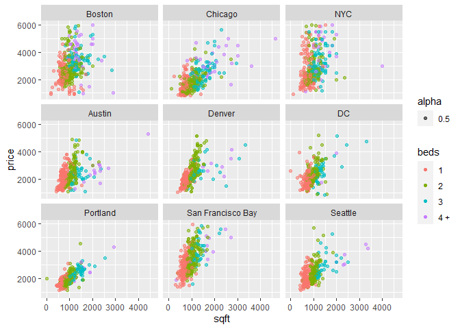
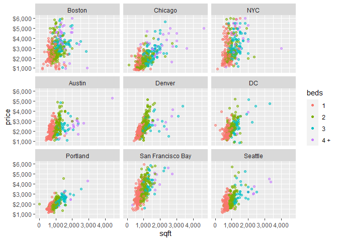
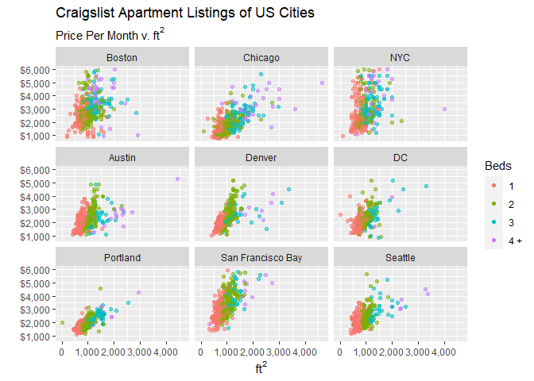
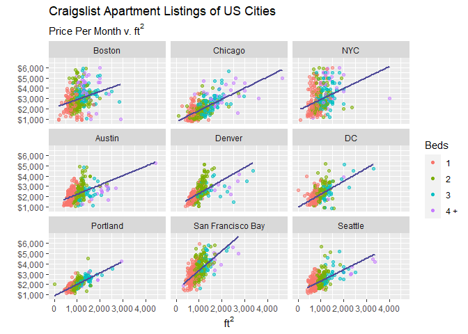
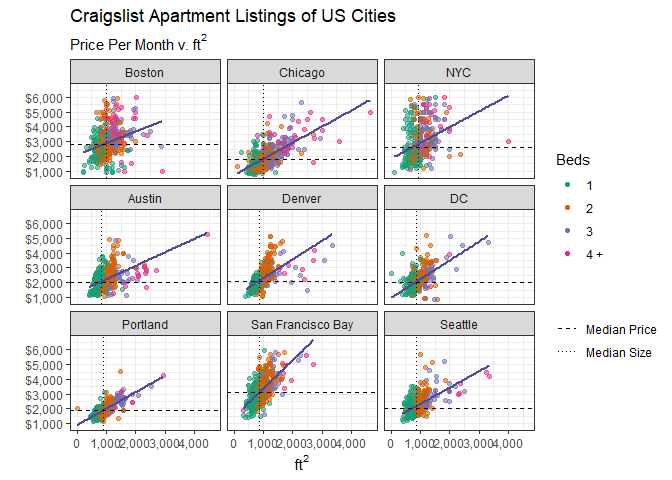

Craigslist Apartments
================
EvanFNG
2022-07-08

To gather data on apartment listings from various US cities, I followed
this tutorial from Towards Data Science:
<https://towardsdatascience.com/web-scraping-craigslist-a-complete-tutorial-c41cea4f4981>

I made a few small adjustments to the code to fix some errors and
customize it to my needs. To view the adjusted code for the web
scraping, go to python -\> web_scrape.py. I used the script to generate
csv files for each city of interest.

### Data Reading

We will take the csv for each city and combine them into a single
dataframe.

``` r
library(tidyverse)
library(scales)

# Lists files in directory
file_source <- fs::dir_ls('data')

file_source
```

    ## data/austin_craigslist.csv       data/boston_craigslist.csv       
    ## data/chicago_craigslist.csv      data/denver_craigslist.csv       
    ## data/newyork_craigslist.csv      data/portland_craigslist.csv     
    ## data/seattle_craigslist.csv      data/sfbay_craigslist.csv        
    ## data/washingtondc_craigslist.csv

``` r
# Use map_dfr and read_csv together to combine all files into one dataframe
appended_files <- file_source |> 
  map_dfr(read_csv, .id = 'filename')

appended_files
```

    ## # A tibble: 26,299 × 8
    ##    filename              date_time           town  title price  beds  sqft url  
    ##    <chr>                 <dttm>              <chr> <chr> <dbl> <dbl> <dbl> <chr>
    ##  1 data/austin_craigsli… 2022-07-09 12:21:00 (Hut… 3/2 …  1500     3  1200 http…
    ##  2 data/austin_craigsli… 2022-07-09 12:19:00 (Cen… Hous…  2400     3  1400 http…
    ##  3 data/austin_craigsli… 2022-07-09 12:15:00 (CAL… SOME…  1100     1    NA http…
    ##  4 data/austin_craigsli… 2022-07-09 12:15:00 (AUS… CRIM…  1400     2    NA http…
    ##  5 data/austin_craigsli… 2022-07-09 12:15:00 (CAL… SOME…  1100     1    NA http…
    ##  6 data/austin_craigsli… 2022-07-09 12:15:00 (#1 … BROK…  1800     3    NA http…
    ##  7 data/austin_craigsli… 2022-07-09 12:15:00 (Geo… 2-1 …  1500     2  1150 http…
    ##  8 data/austin_craigsli… 2022-07-09 12:11:00 (Bet… Grea…  1300    NA   446 http…
    ##  9 data/austin_craigsli… 2022-07-09 12:08:00 (Vis… Beau…  3230     3  2418 http…
    ## 10 data/austin_craigsli… 2022-07-09 11:56:00 (Far… Best…  1148    NA   422 http…
    ## # … with 26,289 more rows

### Data Cleaning

Now that we have one dataframe, we will make some transformations and
remove noisy data.

``` r
appended_files |> 
  mutate(
    # Extract city from filename
    city = str_to_title(str_match(filename, r'(([a-z]+)_craigslist)')[,2]),
    # Renaming some of the city names
    city = recode(
      .x = city,
      'Newyork' = 'NYC',
      'Sfbay' = 'San Francisco Bay',
      'Washingtondc' = 'DC'
    )
  ) |> 
  select(-filename) |> 
  relocate(city, .after = date_time) |> 
  # We can't have missing data in these rows.
  drop_na(price, beds, sqft) |> 
  # First pass at removing noisy data.
  filter(
    sqft <= 6000,
    between(price, 800, 20000)
  ) |> 
  # Many posts on Craigslist are reposted.
  # Title will be the best way to identify those.
  distinct(title, .keep_all = TRUE) ->
  apts

apts
```

    ## # A tibble: 14,232 × 8
    ##    date_time           city   town                 title price  beds  sqft url  
    ##    <dttm>              <chr>  <chr>                <chr> <dbl> <dbl> <dbl> <chr>
    ##  1 2022-07-09 12:21:00 Austin (Hutto)              3/2 …  1500     3  1200 http…
    ##  2 2022-07-09 12:19:00 Austin (Central N. Austin)  Hous…  2400     3  1400 http…
    ##  3 2022-07-09 12:15:00 Austin (Georgetown)         2-1 …  1500     2  1150 http…
    ##  4 2022-07-09 12:08:00 Austin (Vista Oaks Round R… Beau…  3230     3  2418 http…
    ##  5 2022-07-09 11:54:00 Austin (Linea Stillwater)   Mode…  2440     4  1627 http…
    ##  6 2022-07-09 11:54:00 Austin (7011 McKinney Fall… ***O…  1274     2   943 http…
    ##  7 2022-07-09 11:53:00 Austin (Austin)             Luxu…  1784     1   860 http…
    ##  8 2022-07-09 11:50:00 Austin (Northeast Austin)   Luxu…  2266     3  1342 http…
    ##  9 2022-07-09 11:47:00 Austin (Nw Hills)           4bed…  2900     4  2150 http…
    ## 10 2022-07-09 11:47:00 Austin (Northwest Austin)   Best…  1185     1   653 http…
    ## # … with 14,222 more rows

### Sampling the Data

First, I will set a max price threshold. Extreme examples of
ultra-luxury units or incorrectly entered prices will skew the data and
plots.

``` r
price_threshold <- 6000
```

Now, let’s take a reasonably-sized sample from each city.

``` r
apts |> 
  count(city) |> 
  arrange(n)
```

    ## # A tibble: 9 × 2
    ##   city                  n
    ##   <chr>             <int>
    ## 1 NYC                 461
    ## 2 Chicago             734
    ## 3 Boston             1000
    ## 4 Austin             1336
    ## 5 DC                 1979
    ## 6 San Francisco Bay  2039
    ## 7 Denver             2063
    ## 8 Portland           2168
    ## 9 Seattle            2452

New York City has the fewest listings, so if we take equal samples for
each city, it can be no larger than 461. We don’t want to use every data
point, because this will overcrowd the plots.

``` r
# Ensures the same sample on every run
set.seed(123)
sample_data <- apts |> 
  filter(price <= price_threshold) |> 
  group_by(city) |> 
  slice_sample(n = 400) |> 
  ungroup()

sample_data
```

    ## # A tibble: 3,600 × 8
    ##    date_time           city   town                 title price  beds  sqft url  
    ##    <dttm>              <chr>  <chr>                <chr> <dbl> <dbl> <dbl> <chr>
    ##  1 2022-07-08 12:33:00 Austin (Sunset Valley Sout… "Top…  3090     2  1215 http…
    ##  2 2022-07-08 12:31:00 Austin (East 6th St East C… "Lar…  2415     1   778 http…
    ##  3 2022-07-09 00:55:00 Austin (East Austin)        "New…  1975     1   730 http…
    ##  4 2022-07-08 12:12:00 Austin (Eastside)           "\U0…  2667     1   702 http…
    ##  5 2022-07-08 20:46:00 Austin (North)              "**N…  2387     2  1079 http…
    ##  6 2022-07-07 14:56:00 Austin (Austin)             "Kee…  1499     1   613 http…
    ##  7 2022-07-07 08:25:00 Austin (North West Austin)  "Out…  1999     2  1253 http…
    ##  8 2022-07-06 18:06:00 Austin (Downtown / Lady Bi… "One…  3500     1   940 http…
    ##  9 2022-07-06 17:45:00 Austin (Round Rock)         "\U0…  1280     1   555 http…
    ## 10 2022-07-07 12:01:00 Austin (Central)            "~ A…  3662     2  1199 http…
    ## # … with 3,590 more rows

### Exploring the Sample

First, let’s get the mean and median of the price and square footage of
each city. We can also confirm that we have equal size groups for each.

``` r
sample_data |> 
  group_by(city) |> 
  summarise(
    across(where(is.numeric), .fns = list(mean = mean, median = median)),
    group_size = n()
  ) ->
  sample_summary

sample_summary
```

    ## # A tibble: 9 × 8
    ##   city       price_mean price_median beds_mean beds_median sqft_mean sqft_median
    ##   <chr>           <dbl>        <dbl>     <dbl>       <dbl>     <dbl>       <dbl>
    ## 1 Austin          2192.        1989       1.59           1      961.        818 
    ## 2 Boston          2929.        2800       2.11           2     1055.       1000 
    ## 3 Chicago         1972.        1775       2.1            2     1122.       1000 
    ## 4 DC              2141.        2000       1.64           2      926.        872.
    ## 5 Denver          2248.        2062       1.59           1      950.        858 
    ## 6 NYC             2889.        2588.      2.07           2      982.        928.
    ## 7 Portland        1967.        1862.      1.86           2      962.        880 
    ## 8 San Franc…      3216.        3088       1.68           2      911.        858.
    ## 9 Seattle         2247.        2054.      1.72           2      923.        866 
    ## # … with 1 more variable: group_size <int>

The mean and median of the price and square footage will be interesting
information to add to the plots.

While not necessarily required for the plots, it would also be
interesting to have a linear model of price in relation to square
footage for each city. We can get that information by the following:

``` r
sample_data |> 
  nest_by(city)
```

    ## # A tibble: 9 × 2
    ## # Rowwise:  city
    ##   city                            data
    ##   <chr>             <list<tibble[,7]>>
    ## 1 Austin                     [400 × 7]
    ## 2 Boston                     [400 × 7]
    ## 3 Chicago                    [400 × 7]
    ## 4 DC                         [400 × 7]
    ## 5 Denver                     [400 × 7]
    ## 6 NYC                        [400 × 7]
    ## 7 Portland                   [400 × 7]
    ## 8 San Francisco Bay          [400 × 7]
    ## 9 Seattle                    [400 × 7]

`nest_by` works similarly to `group_by`, but creates a tibble column for
each group, consisting of each variable not grouped. It returns a
`rowwise` tibble to perform operations on the tibble columns for the
groups.

``` r
sample_data |> 
  nest_by(city) |> 
  mutate(
    city_lm = list(lm(data$price ~ data$sqft)),
    y_int = pluck(city_lm, 'coefficients')[1],
    slope = pluck(city_lm, 'coefficients')[2],
    equation = str_glue('y = {round(slope, 2)}x + {round(y_int, 2)}'),
    r_squared = cor(data$sqft, data$price)^2
  ) |> 
  # Exit rowwise.
  ungroup() |> 
  select(-data, -city_lm) ->
  cities_lm

cities_lm
```

    ## # A tibble: 9 × 5
    ##   city              y_int slope equation            r_squared
    ##   <chr>             <dbl> <dbl> <glue>                  <dbl>
    ## 1 Austin            1313. 0.915 y = 0.91x + 1312.65    0.260 
    ## 2 Boston            2095. 0.790 y = 0.79x + 2095.26    0.0860
    ## 3 Chicago            744. 1.09  y = 1.09x + 744.01     0.453 
    ## 4 DC                 963. 1.27  y = 1.27x + 962.69     0.320 
    ## 5 Denver            1047. 1.27  y = 1.27x + 1046.71    0.368 
    ## 6 NYC               1836. 1.07  y = 1.07x + 1835.86    0.104 
    ## 7 Portland           891. 1.12  y = 1.12x + 891.49     0.597 
    ## 8 San Francisco Bay 1463. 1.92  y = 1.92x + 1463.08    0.422 
    ## 9 Seattle           1226. 1.11  y = 1.11x + 1225.57    0.358

# Creating the Visual

We’ll start with a basic scatter plot. We’ll convert `beds` and `city`
to factors. This is because we want `beds` to be interpreted as a
discrete value, and we want to control the order of each `city`. We’ll
use the functions `geom_jitter` to help control for data that is too
densely packed, and `facet_wrap` to put each city in its own grid.

Note that the visual may look too small on here. When rendered into a
full window, it will appear as expected.

``` r
sample_data |>
  mutate(
    beds = factor(if_else(
      beds >= 4,
      '4 +', as.character(beds)
      ),
      levels = c('1', '2', '3', '4 +')
    ),
    city = as_factor(city)
  )|>
  ggplot(aes(x = sqft, y = price)) +
  geom_jitter(aes(color = beds, alpha = 0.5)) +
  facet_wrap(~ fct_relevel(
    city,
    'Boston', 'Chicago', 'NYC',
    'Austin', 'Denver', 'DC',
    'Portland', 'San Francisco Bay', 'Seattle'
    )
  ) ->
  p

p
```

<!-- -->

We have the base plot for each city, with a color legend for the number
of beds. We can remove the alpha legend, as we only used that to make
the points somewhat transparent. We can also add units and notation to
the axes numbers.

``` r
p +
  guides(alpha = 'none') +
  scale_x_continuous(labels = label_comma()) +
  scale_y_continuous(
    labels = label_dollar(),
    breaks = seq(1000, price_threshold, 1000)
  ) ->
  p

p
```

<!-- -->

Let’s also add a title, use title-case for the beds legend, and drop the
y-axis label (the dollar sign and our subtitle will make it
self-explanatory.)

``` r
p +
  labs(
    title = 'Craigslist Apartment Listings of US Cities',
    subtitle = expression('Price Per Month v. ft'^2),
    x = expression('ft'^2),
    y = '',
    color = 'Beds'
  ) ->
  p

p
```

<!-- --> We can
add the line for each city’s regression model, as well. We could do this
using the linear models for each city that we created earlier, but
ggplot already has a function built-in to handle that for us. That would
be `stat_smooth`:

``` r
p +
  stat_smooth(method = 'lm', se = FALSE, color = '#504b99') ->
  p

p
```

    ## `geom_smooth()` using formula 'y ~ x'

<!-- -->

Finally, let’s overlay the median price and median square footage for
each city, and add a theme:

``` r
p +
  geom_hline(
    data = sample_summary,
    aes(
      yintercept = price_median,
      linetype = 'Median Price'
    ),
    color = 'black'
  ) +
  geom_vline(
    data = sample_summary,
    aes(
      xintercept = sqft_median,
      linetype = 'Median Size',
    ),
    color = 'black',
    show.legend = FALSE
  ) +
  scale_linetype_manual(
    name = '',
    values = c('dashed', 'dotted')
  ) +
  theme_bw() +
  scale_color_brewer(palette = 'Dark2')
```

    ## `geom_smooth()` using formula 'y ~ x'

<!-- -->
